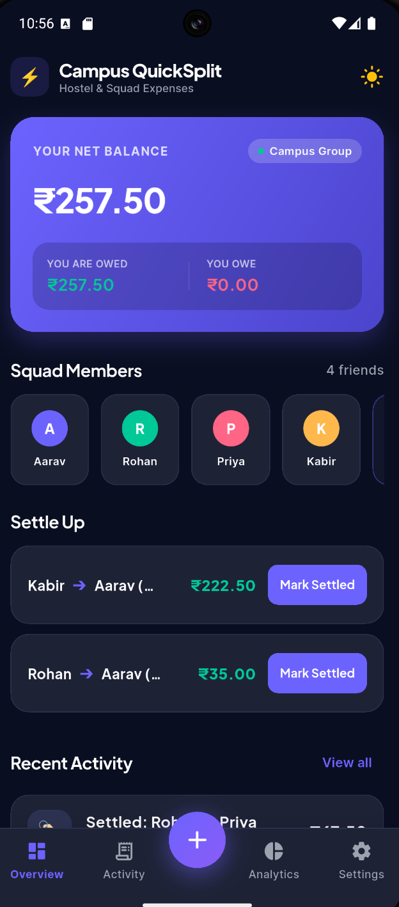
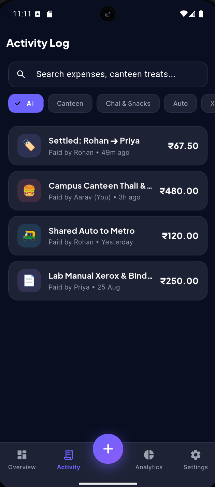
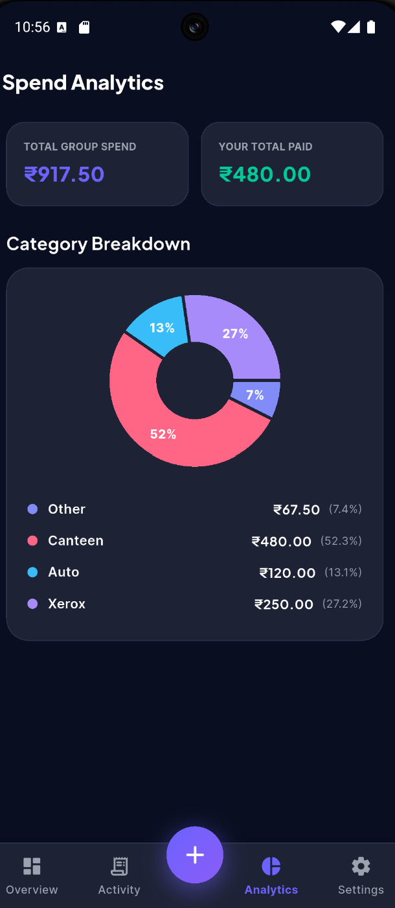

# ⚡ Campus QuickSplit
> **Split Smart. Settle Fast.** — A frictionless, local-first peer expense tracker built specifically for Indian college students.

[](https://flutter.dev)
[](https://pub.dev/packages/provider)
[](https://pub.dev/packages/hive)
[](LICENSE)

---

## 📸 App Preview

| 📊 Dashboard & 3D Balance | 💸 Multi-Payer & Granular Split | 📈 Spend Analytics |
|:---:|:---:|:---:|
|  |  |  |

---

## 💡 Personal Story & Problem Statement

As a college student, shared group expenses happen multiple times every single day:
- 𛎺 **Daily Auto Rides** to campus or metro stations
- 🍛 **Canteen, Mess & Chai Treats** with squad members
- 📄 **Lab Manual Xerox, Printouts & Binding** costs
- 🎬 **Shared Group Subscriptions** (Spotify, Netflix)

Existing expense-splitting platforms introduce **excessive friction**: mandatory phone number signups, slow cloud synchronization, network dependency, and complex onboarding for transient, ad-hoc transactions.

**Campus QuickSplit** solves this by being **100% Local-First**. Open the app, log an expense in under 5 seconds, let the greedy debt optimization algorithm simplify repayments, and settle up completely offline—zero signup required.

---

## 🚀 Key Features by Evaluation Phase

### 🟢 Phase 1: Core Foundation & Reactive UI
- **Aggregated Dashboard:** Live net balance overview ("YOU ARE OWED" vs "YOU OWE").
- **Equal Split Calculator:** Instant proportional math across all squad participants.
- **Activity Log Stream:** Time-ordered feed formatted with Indian Rupee (`₹`) symbols and relative timestamps (`2m ago`, `Yesterday`).
- **Input Sanitization:** Guardrails preventing empty titles, negative amounts, or zero splitters.
- **Provider Architecture:** Clean separation of business logic from visual presentation.

### 🟡 Phase 2: Advanced Splitting & Offline Engine
- **Granular Allocation Modes:**
  - `Equal (=)`: Automatic decimal remainder distribution.
  - `Exact (₹)`: Manual exact amount allocation per participant.
  - `Ratio (%)`: Percentage-based distribution validated against a 100% cap.
- **Local-First Storage:** Complete offline persistence using Hive binary key-value storage (`campus_quicksplit_box`).
- **Settlement Optimization:** Algorithmic layer that simplifies complex debt webs into direct peer repayments.

### 🔵 Phase 3: Analytics, Multi-Payer & UX Polish
- **Diverse Contribution (Multi-Payer):** Allows multiple participants to contribute upfront to a single bill.
- **Spend Analytics:** Interactive custom donut charts powered by `fl_chart` with category breakdowns (Canteen, Auto, Xerox, Mess, Chai).
- **Transactional Safety:** Swipe-to-delete tiles with SnackBar `UNDO` state restoration.
- **System-Wide Light/Dark Theme:** OLED dark palette (`#0A0E21`) with user preference saved across app reboots.

---

## 🧠 Debt Minimization Algorithm

Campus QuickSplit utilizes a **Greedy Graph Minimization Algorithm** to resolve complex debt webs into the absolute minimum number of peer-to-peer repayments:
[ Raw Debts ] [ Net Balances ] [ Optimized Repayment ]
A owes B ₹100 \ A: -₹100 (Debtor)
B owes C ₹100 --> Algorithm --> B: ₹0 --> Algorithm --> A owes C ₹100
C owes A ₹0 / C: +₹100 (Creditor) / (1 transaction instead of 2)

text


### Mathematical Formulation:
1. Compute net balance for each member: $Balance_i = \text{Paid}_i - \text{Owed}_i$.
2. Partition into Debtors ($Balance < 0$) and Creditors ($Balance > 0$).
3. Sort Debtors ascending and Creditors descending.
4. Greedily resolve debt pair $(\text{Debtor}_{max}, \text{Creditor}_{max})$ using $T = \min(|\text{Debtor}|, \text{Creditor})$.
5. **Complexity:** $\mathcal{O}(N \log N)$ time, reducing transaction overhead from $\mathcal{O}(N^2)$ to at most $N-1$ direct transfers.

---

## 🏗 System Architecture

```text
┌─────────────────────────────────────────────────────────┐
│                        UI LAYER                         │
│   [Dashboard]  [Activity Log]  [Analytics]  [Modal]     │
└────────────────────────────┬────────────────────────────┘
                             │
                             ▼
┌─────────────────────────────────────────────────────────┐
│                 PROVIDER STATE ENGINE                   │
│                      (AppProvider)                      │
└─────────────┬─────────────────────────────┬─────────────┘
              │                             │
              ▼                             ▼
┌───────────────────────────┐ ┌───────────────────────────┐
│   DEBT OPTIMIZER ENGINE   │ │      HIVE OFFLINE DB      │
│ (Greedy Graph Minimizer)  │ │  (campus_quicksplit_box)  │
└───────────────────────────┘ └───────────────────────────┘
```


---

## 🛠 Tech Stack

- **Framework:** Flutter 3.47.1 (Dart)
- **State Management:** Provider ^6.1.2
- **Local Persistence:** Hive & Hive Flutter ^2.2.3
- **Visualization:** `fl_chart` ^0.68.0
- **Typography:** `google_fonts` (Plus Jakarta Sans & Inter)
- **Formatters & Utilities:** `intl`, `uuid`

---

## ⚙️ How to Run Locally

```bash
# 1. Clone repository
git clone https://github.com/k-a-r-s-a-n/campus-quicksplit.git
cd campus-quicksplit

# 2. Install dependencies
flutter pub get

# 3. Launch on connected Android device or emulator
flutter run
text


---

### Step-by-Step to Update GitHub:

1. Open **`README.md`** in VS Code.
2. Replace its entire contents with the text block above and **Save (Ctrl + S)**.
3. Take your 3 screenshots from the emulator and place them in `C:\Users\leela\Projects\campus-quicksplit\screenshots\` as `dashboard.png`, `add_expense.png`, and `analytics.png`.
4. Run this in VS Code terminal:

```powershell
git add .
git commit -m "docs: Complete README documentation with architecture diagrams, algorithm math & preview photos"
git push origin main
